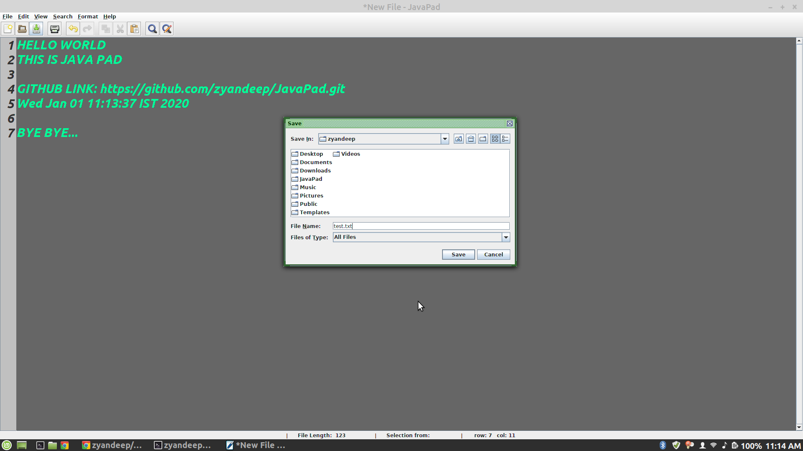
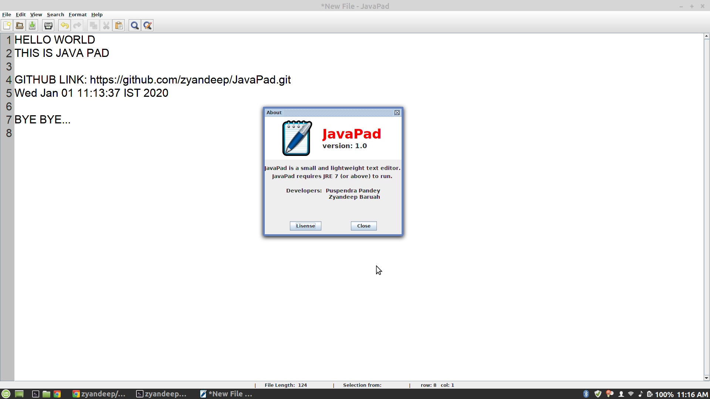

# JavaPad
JavaPad is a simple text editor, like MS Notepad, for Desktop. Like MS Notepad,
it has all the basic plain text editing features, like, Save, Edit, Open, Find, Replace
etc. Some additional features like, Line Numbering, Theme Switching are included in JavaPad.

### Some screeshots
* 
* 
